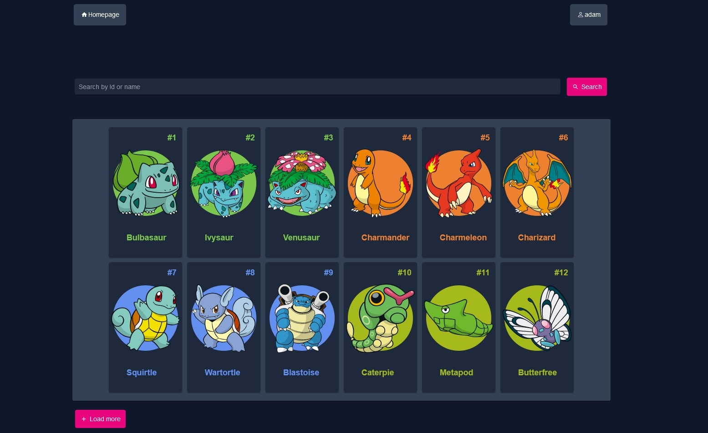
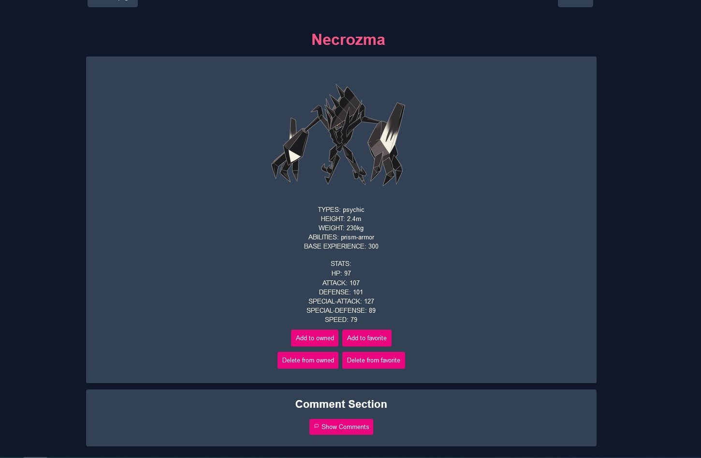
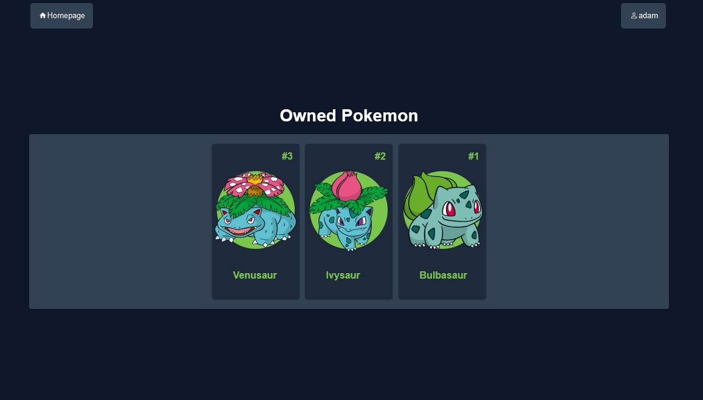
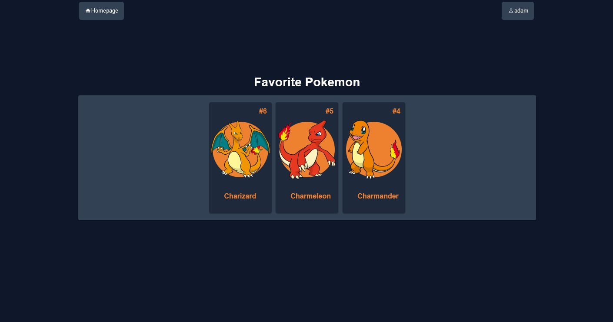
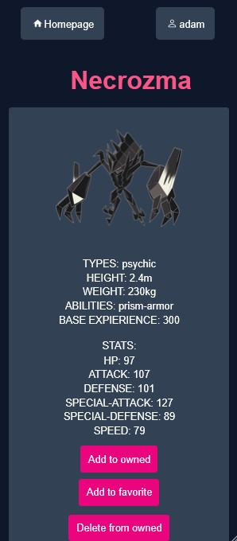

  

# POKEDEX

A web application where you can read some information about pokemons, also divide them into your favorites and owned. There is also a place where you can exchange your opinion about them in the comment section. The webpage is also responsive.

# Technologies
- React/TS
- Java (Spring Boot / Hibernate)
- HTML/CSS
- PostgreSQL
- PokeAPI

# Requirements
- [Docker](https://www.docker.com/)
- [Vite](https://vitejs.dev/)
- [Node.js](https://nodejs.org/en)

# Database

(1).jpg)

# SCREENSHOTS

- Login
  

- Homepage
  

- Search
  

- Comment Section
  

- Description Page
  

- Owned/Favorites
  
  

- Example of responsive design
  